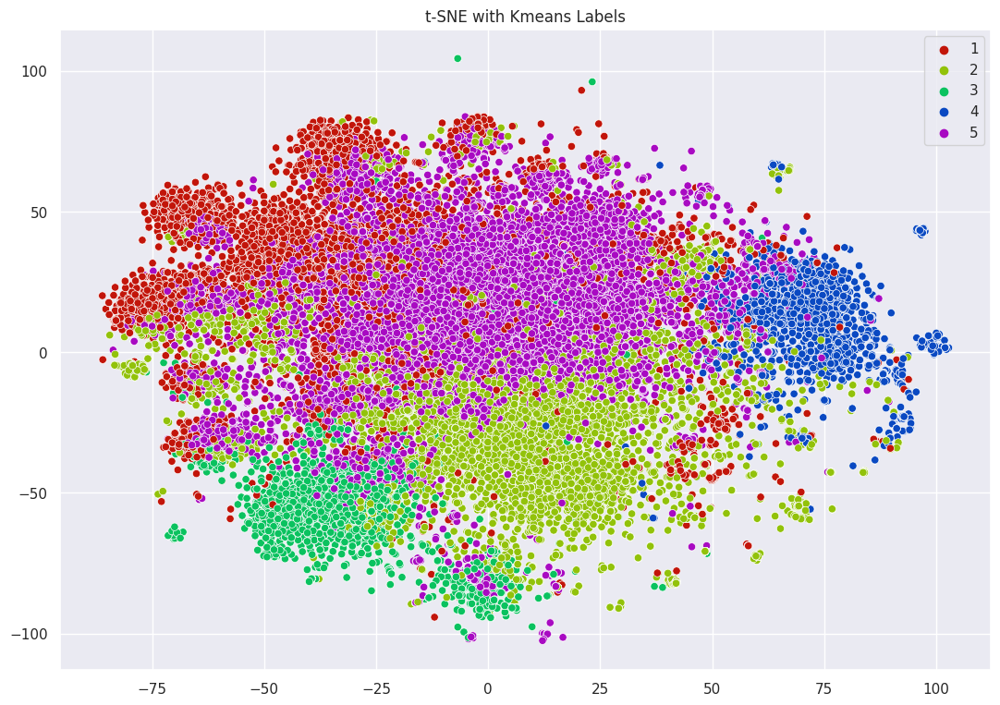

# Linkedin Job posts clustering and salary prediction

## Description

In this project, is applied *clustering* to *LinkedIn* job posts. Initially, the job posts will be clustered using *k-means*, relying on *PCA* scores obtained after vectorizing the data using *TF-IDF* to find the most important words.

After clustering the job posts, we will conduct topic modeling on each cluster, identifying the most significant words within each cluster.

Finally, job salaries will be predicted based on the job posts where the salary is provided. Once this is achieved, we will extend the predictions to job posts where salary information is absent. The resulting salaries will be presented for each cluster obtained through kmeans

## Results and Output

Trough this analysis *LinkedIn* job posts are aggregated in five partialy overlapping clusters, characterized by different job roles or benefits.
Through *Random Forest*, is reached a *Relative Mean Square Error* equal to 13%, which is a good performance considering usual linkedin salary ranges. 
Moreover is analysed the salary difference in the five cluster previously obtained
